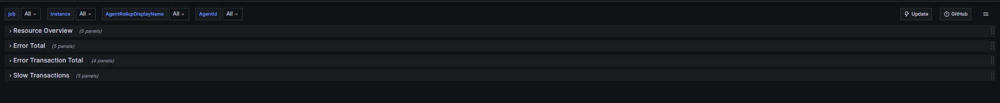
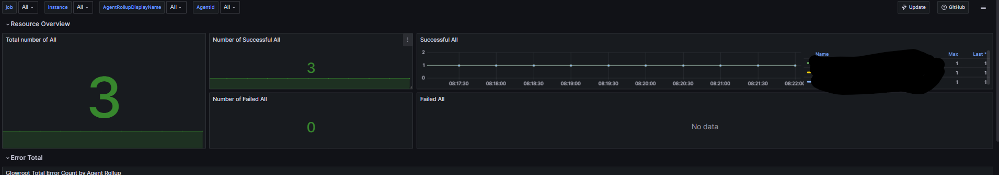
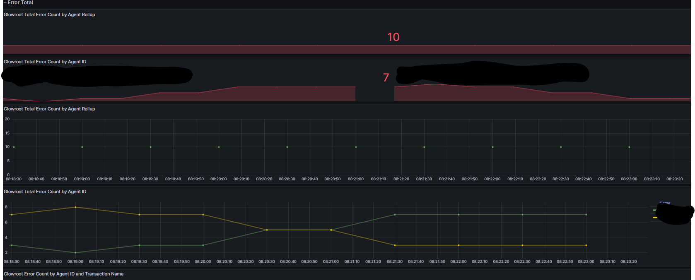

# Glowroot Exporter

A Prometheus exporter for Glowroot APM metrics. This exporter collects various metrics from Glowroot and exposes them in Prometheus format.

## Features

- Collects error statistics and transaction metrics from Glowroot
- Supports agent rollups and child agents
- Configurable metrics update interval
- Prometheus-compatible metrics endpoint

## Configuration

Create a `config.yaml` file with the following structure:

```yaml
server:
  glowroot_url: "http://glowroot-server:4000"  # Glowroot server URL
  exporter_port: 9100                          # Port for the Prometheus exporter
  glowroot_time_interval_minutes: 60           # Time window for fetching metrics
  metrics_update_interval_seconds: 60          # How often to update metrics
```

## Building

### Go Build

```bash
go build -o glowroot-exporter main.go
```

### Docker Build

```bash
docker build -t glowroot-exporter .
```

## Running

### Direct Execution

```bash
./glowroot-exporter
```

### Docker Run

```bash
docker run -p 9101:9101 -v $(pwd)/config.yaml:/app/config.yaml glowroot-exporter:latest
```

## Metrics Exported

- `glowroot_agent_rollup` - Information about Glowroot agent rollups
- `glowroot_agent_rollup_id` - Information about Glowroot agent IDs
- `glowroot_summaries_agent_rollup_id_error_total_count` - Total error count from overall statistics
- `glowroot_summaries_agent_rollup_id_error_transaction_total_count` - Total transaction count from overall statistics
- `glowroot_summaries_agent_rollup_id_error` - Error count per individual transaction
- `glowroot_trace_count_agent_rollup_id_slow_trace` - Total slow trace count for agent
- `glowroot_points_agent_rollup_id_slow_trace` - Slow Trace points information

## Docker Compose Example

```yaml
version: '3'
services:
  glowroot-exporter:
    image: ufkunkaraman/glowroot-exporter:latest
    ports:
      - "9101:9101"
    volumes:
      - ./config.yaml:/app/config.yaml
    restart: unless-stopped
```

## Prerequisites

- Go 1.21 or higher
- Access to a Glowroot APM server
- Docker (optional, for containerized deployment)

## Grafana Dashboard 

- Import Glowroot Exporter Dashboard.json or import  [Grafana](https://grafana.com/grafana/dashboards/23125)

### Global Overview


### Resource Overview


### Error Overview


## Usage

1. Build the exporter:
```bash
go build
```

2. Run the exporter:
```bash
./glowroot-exporter
```

The exporter will start collecting metrics from Glowroot and expose them at `http://localhost:<exporter_port>/metrics`

## Prometheus Configuration

Add the following to your `prometheus.yml`:

```yaml
scrape_configs:
  - job_name: 'glowroot-exporter'
    static_configs:
      - targets: ['localhost:9100']
```